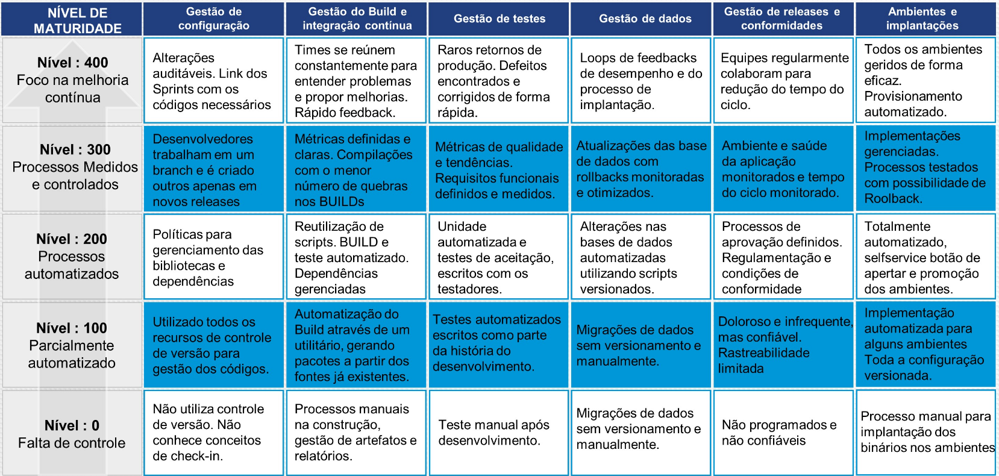

# A Cultura Devops

[Manifesti Ágil](http://agilemanifesto.org)

[Google SRE Book](https://landing.google.com/sre/book.html)

# Pilares DevOps

Existe uma divergência de informações em nossa referência de estudo. 

Se formos nos basear pelo livro **Effective DevOps** em seu capítulo 6 (Chapter 6. The Four Pillars of Effective Devops):

Pelo material da IT Certs, eles baseiam-se no dicionário DevOps (http://devopsdictionary.com/wiki/CAMS)

# Maturidade

